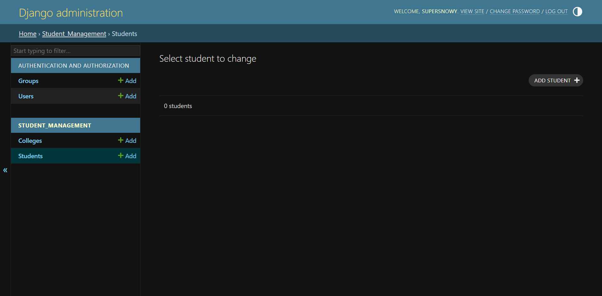
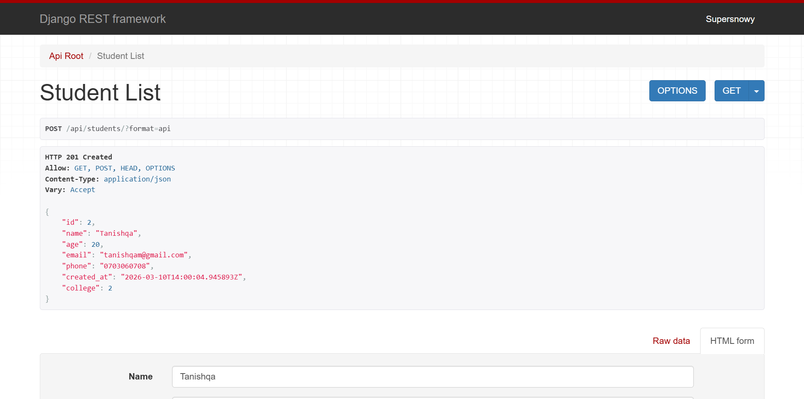
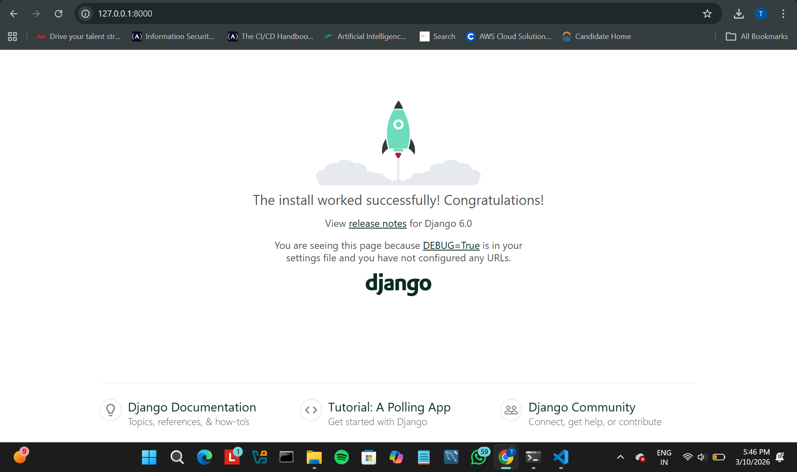
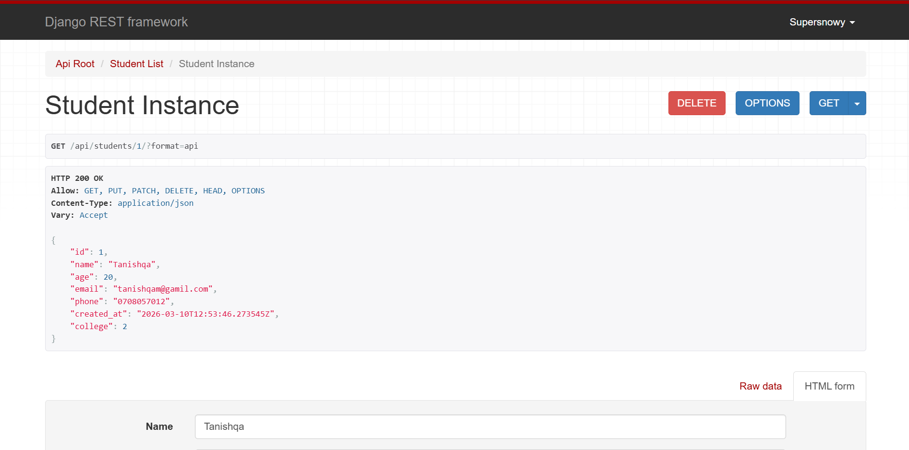

# College Student Management API!!

This project is a backend system built using Django and Django REST Framework to manage college and student data.

Author: Tanishqa Mohite  
Email: tanishqamohite07@gmail.com

## Project Overview
The College Student Management API is a backend application built using Django and Django REST Framework.  
It provides RESTful APIs to manage college and student data with full CRUD functionality.

## Tech Stack
- Python
- Django
- Django REST Framework
- SQLite

## Setup Instructions

1. Clone the repository
git clone https://github.com/tanishqa0708/college-student-management-api.git

2. Navigate to project
cd college_management

3. Install dependencies
pip install -r requirements.txt

4. Apply migrations
python manage.py migrate

5. Run the server
python manage.py runserver

## API Endpoints

GET /api/students/  
POST /api/students/  
GET /api/students/{id}/  
PUT /api/students/{id}/  
DELETE /api/students/{id}/

## Screenshots

### Student API Endpoint

### Postman API Test

### Django Admin Panel

### 🔹 Update Student (PATCH)
